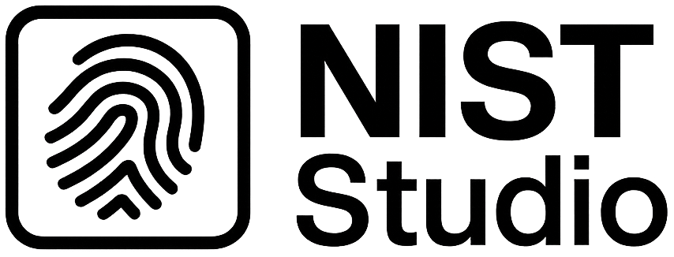

# NIST Studio

<p align="center">
  
</p>

<p align="center">
  <a href="https://www.python.org/"></a>
  <a href="#installation"></a>
  <a href="LICENSE"></a>
</p>

<p align="center">
  <strong>Viewer and editor for ANSI/NIST-ITL biometric files</strong>
</p>

---

NIST Studio is a desktop application for viewing, editing and comparing ANSI/NIST-ITL files. It provides a three-panel interface with record tree navigation, field editing, and image visualization. Built with PyQt5 and the `nistitl` library.

## Features

- **Three-panel interface**: Record tree, field table, and biometric image viewer with drag & drop support
- **Record support**: Type-2 (text), Type-4/13/14/15 (fingerprints), Type-10/17 (photos), Type-7/8/16/19/20 (other images)
- **Side-by-side comparison**: Load two sources (NIST, image, PDF) for visual comparison
  - Typed annotations (MATCH/EXCLUSION/MINUTIA/CUSTOM) with numbered markers
  - Overlay mode with adjustable transparency, blink comparator
  - Calibrated grid/ruler, horizontal/vertical flip
  - Distance measurement (pixels and mm when calibrated)
  - Linked views: synchronized zoom/pan, rotation per image
  - DPI calibration: two-point calibration + resample to target DPI
  - Image enhancements: brightness, contrast, gamma, inversion
  - Export annotated comparison as JPG
- **Signa Multiple export**: Automated transformation (delete 2.215, set 2.217=11707)
- **PDF export**: Decadactylary sheet (A4) from available fingerprint images
- **Image codecs**: WSQ (via NBIS `dwsq`) and JPEG2000 (via `imagecodecs`)
- **Offline**: Fully local operation, no backend required

## Installation

### Prerequisites

- Windows 10+, macOS 10.14+, or Linux (Ubuntu 20.04+)
- Python 3.8+ with pip

### From source

```bash
git clone https://github.com/ybdn/myNIST.git
cd myNIST
python3 -m venv venv
source venv/bin/activate  # Windows: venv\Scripts\activate
pip install -r requirements.txt
```

### Using Make

```bash
make setup  # Creates venv, installs dependencies and dev tools
```

## Quick Start

```bash
# Run from source
python -m mynist
# or
./run.sh

# Run built executable
./dist/mynist
```

Open a `.nist`, `.nst`, `.eft`, `.an2` or `.int` file via `File > Open` or drag and drop.

## Usage

| Panel | Description |
|-------|-------------|
| **Left** | Record tree (Type/IDC hierarchy) |
| **Center** | Field table (editable for Type-2) |
| **Right** | Biometric image viewer |

### Keyboard Shortcuts

| Shortcut | Action |
|----------|--------|
| `Ctrl+O` | Open file |
| `Ctrl+E` | Export Signa Multiple |
| `Ctrl+W` | Close file |
| `Ctrl+Q` | Quit |

## Build & Distribution

```bash
# Build executable
./build.sh
# or
make build

# Ubuntu system install
sudo ./install_ubuntu.sh

# Uninstall
sudo ./uninstall_ubuntu.sh
```

## Testing

```bash
pytest              # Run tests
make test           # Verbose output
make test-coverage  # With coverage report
make lint           # flake8
make format         # black formatter
```

## Project Structure

```
myNIST/
├── mynist/              # Application source code
│   ├── controllers/     # Business logic (file, export, PDF)
│   ├── models/          # Data model (NISTFile wrapper)
│   ├── views/           # UI components (PyQt5)
│   ├── utils/           # Utilities (config, codecs, logging)
│   └── resources/       # Icons and assets
├── tests/               # Unit tests with fixtures
├── docs/                # Documentation
├── build.sh             # Build script
├── run.sh               # Development launcher
└── requirements.txt     # Python dependencies
```

## Documentation

| Document | Description |
|----------|-------------|
| [Quick Start](docs/quickstart.md) | Installation and first steps |
| [User Guide](docs/user_guide.md) | Complete user documentation |
| [Developer Guide](docs/developer_guide.md) | Architecture and contribution |
| [Visual Guide](docs/guide-visuel.md) | Interface walkthrough with diagrams |
| [Cheatsheet](docs/cheatsheet.md) | Quick reference |
| [Roadmap](docs/roadmap.md) | Product roadmap |

## Troubleshooting

| Problem | Solution |
|---------|----------|
| `ModuleNotFoundError: nistitl` | `pip install --upgrade nistitl` |
| PyQt5 missing | `pip install --upgrade PyQt5` |
| WSQ not readable | Install NBIS (`dwsq` in PATH) |
| JPEG2000 not readable | `pip install imagecodecs` |
| Executable won't start | Rebuild on target platform |

## License

Proprietary License - All rights reserved. See [LICENSE](LICENSE).

**Author**: Yoann Baudrin
**Version**: 0.1.0
